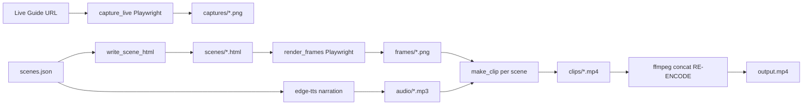

# Static Guide Overview Video — Packaging Blueprint

**Status:** Phase 3–4 in progress (toolkit verified; PR #47 open)
**Last updated:** 2026-06-17
**Pilot:** [mulesoft-claude-onboarding](https://github.com/m9751/mulesoft-claude-onboarding)
**Agent prompt:** `PRM-PDLV-006` (`prompts/product-delivery/PRM-PDLV-006_static-guide-overview-video.md`)
**Pilot run log:** `demo-output/PROMPT_LOG.md`

This document tracks **how the pilot was built** and defines **what to extract** into a reusable package.

---

## 1. What shipped (pilot facts)

| Layer | Artifact | Location |
|-------|----------|----------|
| Source guide | Static HTML onboarding guide | `index-v2.html` → synced to `index.html` |
| Scene contract | 9-beat narrated story + optional silent hero | `demo-output/scenes.json` |
| Build engine | Playwright capture → scene frames → TTS → ffmpeg mux | `demo-output/build_demo.py` |
| Primary output | ~60s narrated MP4 | `demo-output/output.mp4` |
| Embed | One `<video controls>` per Welcome surface | `index-v2.html` (Claude + Cursor tabs) |
| Tracking | 3 beacons: `video_started`, `video_completed`, `video_unmuted` | inline JS → smokin-territory beacon API |
| Verify | Post-deploy smoke script | `demo-output/smoke-test.sh` |
| Live | Vercel static host | https://mulesoft-claude-cursor-onboarding.vercel.app/ |

**Timeline:** HTML guide May 24–25, 2026 · video pipeline June 2, 2026 (commit `283a3bc`).

---

## 2. Build pipeline (as implemented)



### Stage details

| Stage | Tool | Input | Output | Notes |
|-------|------|-------|--------|-------|
| **Live capture** | Playwright (async) | `BASE_URL` + scripted navigation | `captures/*.png` | Scrolls tabs, clicks `#etab-scriptflow`, screenshots sections |
| **Scene HTML** | Python string templates | `scenes.json` scene objects | `scenes/{id}.html` | 8 layout types; MuleSoft brand CSS baked in |
| **Frame render** | Playwright screenshot | Local scene HTML @ 1920×1080 | `frames/{id}.png` | Per-layout wait times (950–1500ms for CSS animations) |
| **Narration** | edge-tts | `scene.narration` text | `audio/{id}.mp3` | Voice from manifest (`en-US-AndrewNeural`) |
| **Per-scene clip** | ffmpeg | frame + audio + duration | `clips/{id}.mp4` | Optional Ken Burns (`zoompan`); duration = max(scene.duration, audio+0.35s) |
| **Final mux** | ffmpeg concat | `clips/*.mp4` | `output.mp4` | **Must re-encode** — `-c copy` causes DTS hiccups |

### Commands

```bash
# Full rebuild (captures + frames + narrated video + archived hero)
cd demo-output && python3 build_demo.py

# Hero silent only (archive; not embedded on Welcome)
cd demo-output && python3 build_demo.py hero

# Post-deploy verify
./demo-output/smoke-test.sh
```

### Hard requirements (proven in pilot)

1. **ffmpeg final concat:** re-encode with `fps=25`, `libx264`, `aac`, `aresample=async=1` — never stream-copy.
2. **HTML sync:** edit `index-v2.html`, then `cp index-v2.html index.html` before push (Vercel serves `index.html`).
3. **Screenshot paths:** scene HTML resolves repo screenshots as `../../screenshots/…` (not `../`).
4. **One video per surface:** no silent autoplay loop on same page as primary video (removed after user feedback).
5. **Pacing guard:** Edition 2 = 9 beats, ~60s; Edition 3 (150-word cap) rejected as unusable.

---

## 3. Scene schema (contract to package)

`scenes.json` is the **story SSOT**. Genericize as `scenes.schema.json`.

### Top-level

```json
{
  "title": "string",
  "edition": "number",
  "voice": "edge-tts voice id",
  "brand": { "css_vars": {}, "logo": "path" },
  "base_url": "live guide URL for captures",
  "hero_silent": { "optional": true },
  "scenes": []
}
```

### Scene object (required fields)

| Field | Type | Purpose |
|-------|------|---------|
| `id` | string | Filename stem (`01-hook`) |
| `layout` | enum | Renderer template (see §4) |
| `duration` | number | Minimum seconds; extended if audio longer |
| `kind` | `title` \| `content` | Dark vs light body class |
| `narration` | string | edge-tts input |
| `image` | string? | Frame/capture path |
| `title`, `subtitle` | string? | On-screen copy |
| `badges` | array? | `proof_highlight` badge chips |
| `ken_burns` | bool? | Slow zoom on still |
| `faux_cursor`, `scan_highlight` | bool? | Proof scene overlays |

### Pilot scene arc (Edition 2 — reference, not hardcoded)

1. `01-hook` — kinetic_pain
2. `02-salesforce` — split_imagine
3. `03-outcomes` — kinetic_outcomes
4. `04-proof-mcp` — proof_highlight
5. `05-proof-exchange` — proof_highlight
6. `06-pick-editor` — editor_tabs
7. `07-scriptflow` — image
8. `08-salesforce` — image
9. `09-cta-inguide` — cta_inguide

---

## 4. Layout library (extract from build_demo.py)

| Layout | Use case | Animation notes |
|--------|----------|-----------------|
| `kinetic_pain` | Hook / problem | Pop + fadeUp badges |
| `split_imagine` | Value prop + screenshot | slideL + fadeUp |
| `kinetic_outcomes` | Capability chips + proof image | pop stagger |
| `proof_highlight` | Screenshot + badges + optional cursor/scan | faux_cursor pulse |
| `editor_tabs` | Editor picker | tab chips + screenshot |
| `depth_tabs` | Two-image depth | picture-in-picture |
| `cta_steps` | Action ladder + image | pop stagger |
| `cta_inguide` | In-guide CTA (no external URL) | centered dark card |
| `image` | Default title + subtitle + image | fadeUp |

**Brand coupling today:** `BASE_CSS` in `build_demo.py` hardcodes MuleSoft/Salesforce tokens. Package as `brand.json` → injected CSS.

---

## 5. Live capture script (project-specific seam)

`capture_live()` in `build_demo.py` is **100% pilot-specific** — URL params, tab IDs, slide selectors.

**Package pattern:** separate `captures.yaml` describing navigation steps; engine executes generically; pilot repo ships its own file.

---

## 6. Embed + tracking kit (templates to package)

### HTML embed block

One block per surface with `data-video-context`, `<video controls>`, `/demo-output/output.mp4`.

### Beacon events (fixed set)

| Event | When |
|-------|------|
| `video_started` | First `play` |
| `video_completed` | `ended` |
| `video_unmuted` | Volume unmute |

---

## 7. Package structure (target)

```
static-guide-video/
├── README.md
├── schema/scenes.schema.json
├── toolkit/build_video.py
├── toolkit/capture_runner.py
├── toolkit/layouts/
├── templates/embed-block.html
├── templates/beacon-snippet.js
├── templates/smoke-test.sh
└── pilots/mulesoft-claude-onboarding/
```

### Two-artifact model

| Artifact | Owner | Contents |
|----------|-------|----------|
| **Prompt** | `prompt-registry` | `PRM-PDLV-006` |
| **Toolkit** | `static-guide-video` (new) | Schema, engine, layouts, templates |
| **Pilot log** | Target repo `demo-output/PROMPT_LOG.md` | Lessons, deploy quirks |

---

## 8. Parameterization checklist (pilot → generic)

| Currently hardcoded | Package as |
|---------------------|------------|
| `BASE_URL` | `scenes.json` → `base_url` or env `GUIDE_URL` |
| `BASE_CSS` + logo path | `brand.json` |
| `capture_live()` navigation | `captures.yaml` per project |
| `edge-tts` binary path | env `EDGE_TTS` or `python3 -m edge_tts` |
| Output dir layout | CLI `--output-dir` |
| `smoke-test.sh` proposal_id | `--tracking-id` flag |

---

## 9. Dependencies

| Dependency | Purpose |
|------------|---------|
| Python 3.9+ | Orchestration |
| playwright | Live capture + frame render |
| edge-tts | Narration MP3 |
| ffmpeg / ffprobe | Clip + concat |

No MCP required for the proven pilot path.

---

## 10. Packaging phases

### Phase 1 — Document
- [x] This blueprint
- [x] Pilot log (`PROMPT_LOG.md`)
- [x] Agent prompt (`PRM-PDLV-006`)

### Phase 2 — Extract schema + layouts
- [x] Publish `scenes.schema.json` (+ `captures.schema.json`, `brand.example.json` in `packages/static-guide-video/schema/`)
- [ ] Split layouts into modules
- [x] Add `brand.json` injection in build engine (`--brand` flag in `build_video.py`)

### Phase 3 — Genericize engine
- [x] `build_demo.py` → `build_video.py` with CLI
- [x] `capture_runner.py` + pilot `captures.yaml`
- [x] Parameterized `smoke-test.sh` in `templates/`

### Phase 4 — Skill / install path
- [x] New skill `static-guide-video` at `~/.grok/skills/static-guide-video/SKILL.md`
- [x] Register in smokin-os platform catalog (PR smokin-os `docs/static-guide-video-catalog`)
- [ ] Second pilot on non-MuleSoft HTML guide

### Phase 5 — Distribution
- [x] `prompt-registry/packages/static-guide-video/` (PR #47)
- [x] Pilot rebuild verified with `build_video.py` (2026-06-17: 59.9s, 9 beats, re-encoded concat)
- [x] PRM-PDLV-006 references toolkit version pin (v1.1.0)
- [x] Merge PR #47 (merged 2026-06-17)

---

## 11. vs existing `demo-video` skill

The bundled `demo-video` skill does not match the proven pilot (`build.sh` vs `build_demo.py`, no scenes.json SSOT, no embed/beacon kit). **Package the pilot implementation as canonical.**

---

## 12. Pilot file map

```
mulesoft-claude-onboarding/
├── index-v2.html
├── index.html
├── screenshots/
├── mulesoft-logo.png
└── demo-output/
    ├── scenes.json
    ├── build_demo.py
    ├── output.mp4
    ├── smoke-test.sh
    └── PROMPT_LOG.md
```

---

## 13. Open decisions

1. Repo home: new `static-guide-video` vs `prompt-registry/packages/`?
2. Skill name: `static-guide-video` vs extend `demo-video`?
3. Second pilot: which HTML guide next?
4. NotebookLM Video Overview path: same package or separate PRM?
